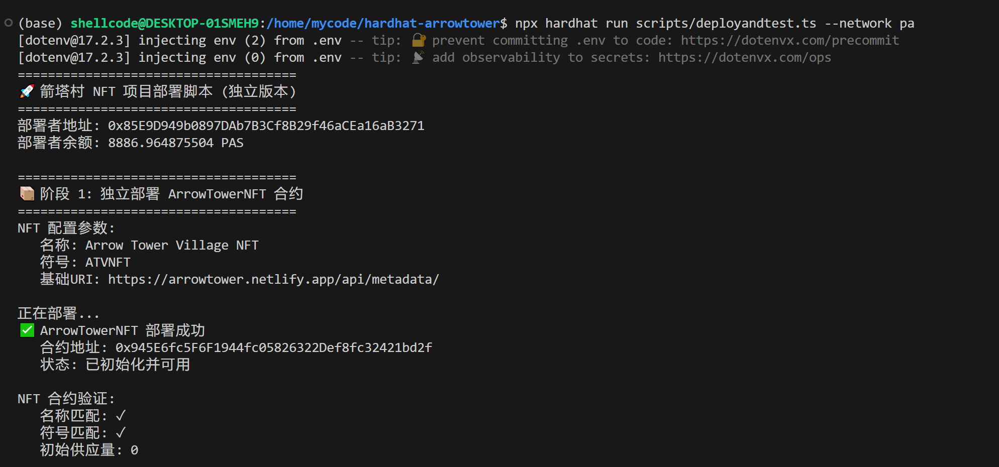
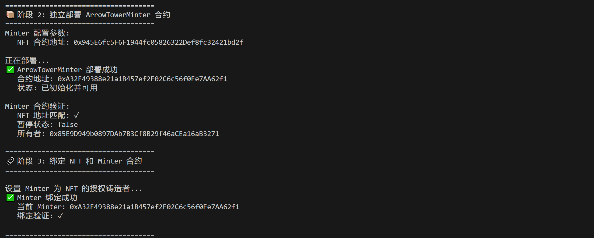
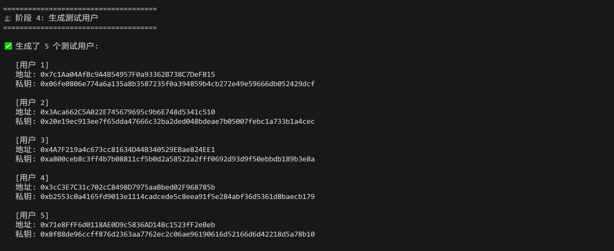
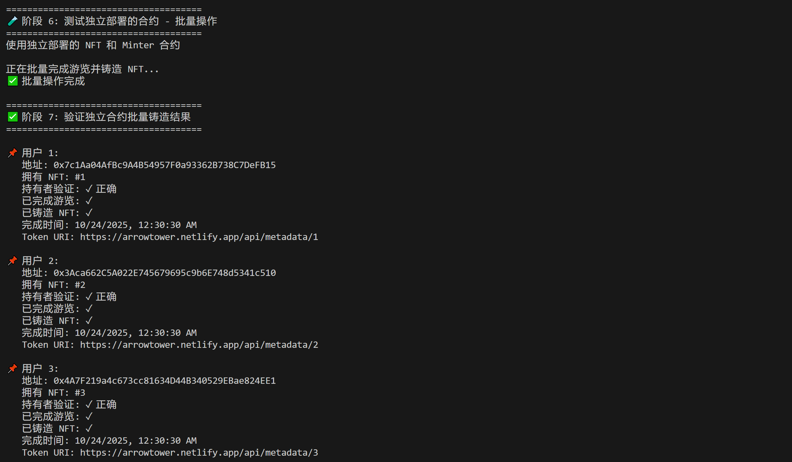
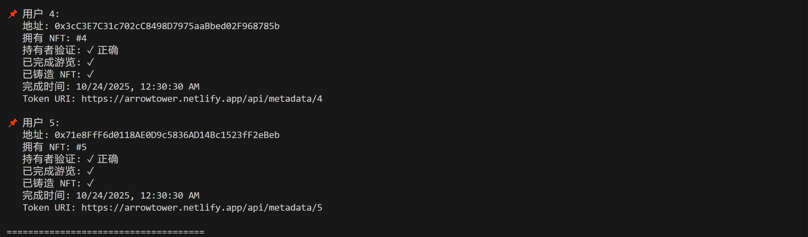
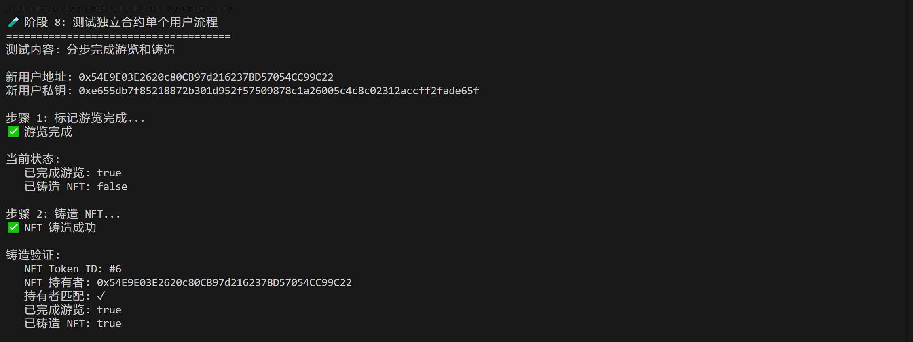
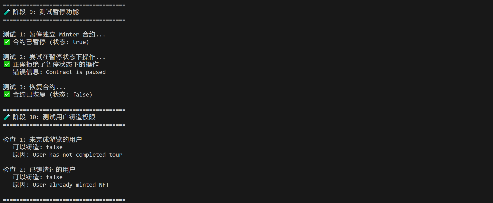
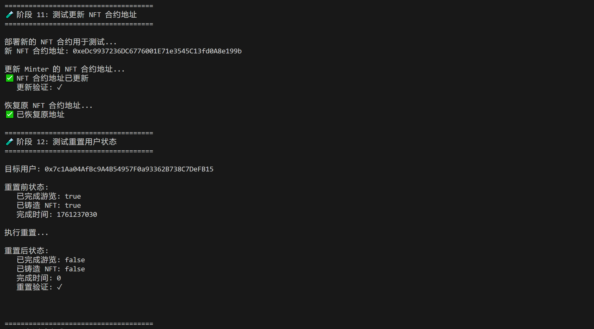
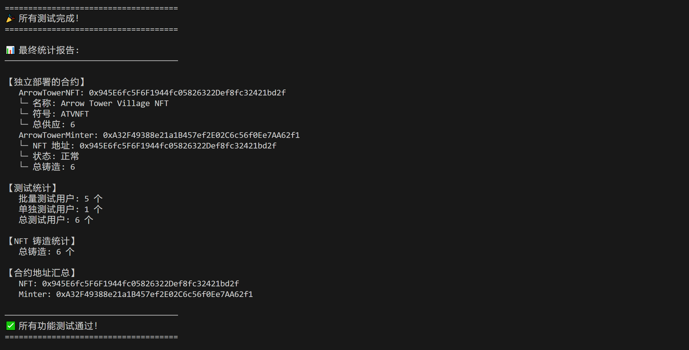

# ArrowTower

[](https://github.com/easyshellworld/arrowtower-dapp/blob/main/LICENSE)[](https://github.com/easyshellworld/arrowtower-dapp/pulls)[](https://github.com/easyshellworld/arrowtower-dapp/stargazers)[](https://github.com/easyshellworld/arrowtower-dapp/issues)[](https://github.com/easyshellworld/arrowtower-dapp/pulls?q=is%3Apr+is%3Aclosed)[](https://github.com/easyshellworld/arrowtower-dapp/commits/main)

[](https://polkadot.network/)[](https://soliditylang.org/)[](https://wagmi.sh/)[](https://hardhat.org/)

[](https://nextjs.org/)[](https://www.typescriptlang.org/)[](https://tailwindcss.com/)

[](https://arrowtower.netlify.app/)[](https://github.com/easyshellworld/arrowtower-dapp/actions)[](https://github.com/easyshellworld/arrowtower-dapp/actions)[](https://hub.docker.com/)


## 📖 项目简介

ArrowTower 是一个基于 Polkadot 生态的地理位置打卡平台，通过**零 Gas 费**后端代铸造技术，让用户无门槛体验 Web3。首期聚焦箭塔村乡村旅游场景，游客完成特色路线打卡和互动任务后，系统自动发放独特 NFT 数字纪念品，无需用户了解Gas费或支付费用，学习钱包使用与签名。


平台可快速拓展至 **Web3 会展活动**、**城市文旅探索**、**教育研学**、**商业营销**、**公益活动** 等多个商业场景。通过链上身份验证和可验证数字凭证，为文旅、会展、教育、营销等行业提供创新的用户互动和数字资产解决方案。

**🌐 演示网站**：https://arrowtower.netlify.app/

## ✨ 核心特性

- **🎁 零 Gas 费体验**：基于 PolkaVM 后端代铸造技术，用户无需支付 Gas。  
- **🚀 即刻生效**：Fork 或克隆项目后，拉起 Docker 镜像即可进入系统，真正做到开箱即用。  
- **🔧 多部署形式**：支持 Docker 部署、Kubernetes 部署、GitHub Actions 一键 CI/CD 上线。  
- **🔄 队列铸造机制**：支持事务队列、批量 NFT 铸造 (queue-minting)，可应对高并发场景。  
- **🖥️ 前端可部署合约**：前端管理界面直接支持部署、配置合约地址，无需后端改造即可切换不同 NFT 合约。  
- **📍 地理位置＋二维码校验打卡**：支持 GPS 定位校验 + 二维码扫描，多重验证保障打卡有效性。  
- **🎨 互动任务系统**：拍照上传、知识问答、任务打卡、成就解锁等，提升用户参与感。  
- **📊 数据统计看板**：实时统计用户行为、任务进度、铸造量、打卡人数等链上 + 线下数据。  
- **🧩 模块化可复用**：任务系统、打卡系统、NFT 模块、数据统计模块均可拆分复用。  
- **⚡ PolkaVM 驱动**：基于 PolkaVM 在 Polkadot 生态的测试网运行，享受高性能 ＋ 低成本优势。


## 🔑 核心功能模块

1. **用户认证模块**  
   - 钱包连接
   - 签名认证 + 会话管理（NextAuth）  
2. **地理位置打卡模块**  
   - GPS 定位校验  
   - 二维码 QR 扫描校验  
   - 打卡记录同步至链上  
3. **任务系统模块**  
   - 创建／编辑任务路线等（如拍照上传、问答、打卡）  
   - 奖励触发器（完成任务自动触发 NFT 铸造）  
4. **NFT 铸造模块**  
   - 后端代铸造（用户无需 Gas），可批量队列铸造（Queue Minting）  
   - 前端配置合约地址/ABI，支持替换 NFT 合约部署场景  
   - 铸造结果记录链上，用户钱包自动接收 NFT  
5. **数据统计模块**  
   - 实时统计用户打卡、任务完成、铸造量、活跃度、参与率等指标  
   - 链上数据 + 本地数据库数据融合展示  
   - 图表看板，便于运营人员分析活动效果  
6. **部署运维模块**  
   - 提供 Dockerfile ＋ docker-compose 配置，一键启动服务  
   - 支持 GitHub Actions／GitLab CI 一键构建 & 部署流程  
   - 支持切换 网络（本地、测试网、主网）与 DB 配置（PostgreSQL/SQLite） 

## 🎯 应用场景

### 首期场景：箭塔村乡村旅游

游客通过 dApp 浏览箭塔村特色旅游路线，到达指定地点后通过地理位置校验或扫描二维码完成打卡，完成互动任务（拍照上传、知识问答、文化体验）积累成就。完成完整路线后系统自动铸造并发送独特的箭塔村 NFT 数字纪念品到用户钱包（无需用户操作）。

**价值**：提升游客游览趣味性和参与度，为箭塔村建立数字化旅游品牌，通过 NFT 实现长期用户连接和二次传播。

### 拓展场景

**🎪 Web3 会展活动**
- 会议签到打卡、展位互动、演讲厅打卡、社交网络打卡
- 根据打卡完成度自动发放不同等级的参会证明 NFT
- 链上身份验证确保参会者身份真实性，防止代签到
- 实时数据统计，为主办方和展商提供可量化的效果数据
- 适用于区块链峰会、Web3 黑客松、行业展览会、开发者大会等

**🏙️ 城市文旅探索**
- 历史文化线路、美食探店路线、艺术文化路线、城市挑战赛
- 促进文旅消费和城市品牌传播，建立城市数字文化资产

**📚 教育与研学**
- 校园定向越野、研学旅行记录、实践课程打卡、毕业纪念册
- 增强学习趣味性，建立链上教育档案，提供可验证的课外活动证明

**🛍️ 商业营销活动**
- 品牌联动打卡、新品发布会、会员体系升级、线下快闪活动
- 提升用户到店率和互动率，打造品牌数字资产和 Web3 社区基础

**🤝 社区与公益活动**
- 志愿服务记录、环保行动打卡、社区活动参与、慈善捐赠记录
- 建立可信的公益记录体系，提升公益活动透明度和公信力

## 🛠️ 技术架构

### 技术栈

**前端**
- **框架**：Next.js 15+ (App Router)
- **样式**：Tailwind CSS + shadcn/ui
- **区块链交互**：wagmi + viem
- **认证系统**：NextAuth.js
- **状态管理**：React Hooks

**后端**
- **API 层**：Next.js API Routes
- **数据库 ORM**：Prisma
- **NFT 铸造**：后端代铸造（Zero Gas Fee）

**区块链**
- **虚拟机**：PolkaVM
- **测试网络**：Polkadot Hub Testnet
- **智能合约**：
  - Minter 合约：`0x079098fb8e901DE45AB510fA669bdE793DfEBD50`
  - NFT 合约：`0x9373197B94f4633FBc121532F3cF3948FD4a5a15`


### 系统架构

```
┌─────────────────────────────────────────┐
│         用户界面层 (Next.js)             │
│    React + Tailwind CSS + shadcn/ui     │
└──────────────────┬──────────────────────┘
                   │
┌──────────────────▼──────────────────────┐
│        区块链交互层 (wagmi + viem)       │
│         用户钱包连接与交易签名            │
└──────────────────┬──────────────────────┘
                   │
┌──────────────────▼──────────────────────┐
│    业务逻辑层 (API Routes + NextAuth)   │
│      地理位置验证 | 任务管理 | 数据统计    │
└──────────────────┬──────────────────────┘
                   │
┌──────────────────▼──────────────────────┐
│      数据持久层 (Prisma + Database)      │
│      用户数据 | 打卡记录 | 任务进度        │
└──────────────────┬──────────────────────┘
                   │
┌──────────────────▼──────────────────────┐
│       区块链层 (PolkaVM + Testnet)       │
│  Polkadot Hub Testnet | Smart Contracts │
└─────────────────────────────────────────┘
```

## 🚀 快速开始

### 环境要求

- Node.js 20.x 或更高版本
- 数据库（PostgreSQL / MySQL / SQLite）

### 安装步骤

#### 1. 克隆项目

```bash
git clone https://github.com/easyshellworld/arrowtower-dapp.git
cd arrowtower-dapp
```

#### 2. 智能合约部署与测试

**2.1 进入合约目录并安装依赖**

```bash
cd contracts/hardhat-arrowtower
npm install
```

**2.2 配置合约环境变量**

创建 `.env` 文件并配置以下内容：

```env
# 本地网络私钥示例
PRIVATE_KEY_LOCAL="0x...."

# passethub (测试网) 私钥
PRIVATE_KEY_PA="0x...."
```

**2.3 部署与测试合约**

```bash
# 本地网络部署与测试
npx hardhat run scripts/deploy.ts --network localNode
npx hardhat run scripts/deployandtest.ts --network localNode

# 使用 passet-hub 测试网部署与测试
npx hardhat run scripts/deploy.ts --network passethub
npx hardhat run scripts/deployandtest.ts --network passethub
```

**2.5 部署与测试合约反馈**











**2.5 返回项目根目录**

```bash
cd ../..
```

#### 3. dApp 应用安装与配置

**3.1 安装依赖**

```bash
npm install
```

**3.2 配置应用环境变量**

创建 `.env` 文件并配置以下内容：

```env
# 数据库配置
DATABASE_URL="your_database_url"

# NextAuth 配置
NEXTAUTH_SECRET="your_nextauth_secret"
NEXTAUTH_URL="http://localhost:3000"

# 配置网站基本链接
NEXT_PUBLIC_ARROW_TOWER_BASE_URL="https://arrowtower.netlify.app/"

# 智能合约地址
NEXT_PUBLIC_MINTER_CONTRACT="0x079098fb8e901DE45AB510fA669bdE793DfEBD50"
NEXT_PUBLIC_NFT_CONTRACT="0x9373197B94f4633FBc121532F3cF3948FD4a5a15"

# 后端铸造私钥（仅服务端）
PRIVATE_KEY="your_private_key"
```

**3.3 初始化数据库**

```bash
npx prisma generate
npx prisma db push
npm run init:db
```

**3.4 启动开发服务器**

```bash
npm run dev
```

**3.5 访问应用**

打开浏览器访问 [http://localhost:3000](http://localhost:3000)

## 📦 项目结构

```
arrowtower-dapp/
├── contracts/                 # 智能合约 (Hardhat 项目)
│   └── hardhat-arrowtower/
│       ├── contracts/         # Solidity 源码（arrow_tower_minter.sol, arrow_tower_nft.sol, ...）
│       ├── scripts/           # 部署 / 测试脚本
│       ├── test/              # 智能合约测试
│       ├── artifacts-pvm/     # 编译产物
│       └── typechain-types/   # TypeChain 类型
├── prisma/                    # Prisma ORM（schema / migrations / client）
│   └── (schema.prisma / migrations / client)
├── src/                       # 应用源码（已从 log 中识别）
│   ├── app/                   # Next.js App Router 源码（页面与 API 路由）
│   │   ├── admin/             # 管理后台页面
│   │   ├── api/               # API 路由（server-only）
│   │   │   ├── admin/
│   │   │   │   └─checkins/    # 管理相关接口
│   │   │   ├── auth/
│   │   │   │   ├─signin/
│   │   │   │   └─[...nextauth]/
│   │   │   ├── checkins/
│   │   │   ├── checkmint/
│   │   │   ├── health/
│   │   │   ├── metadata/
│   │   │   │   └─[id]/
│   │   │   ├── pois/
│   │   │   ├── route_list/
│   │   │   └── upload/
│   │   │       └─photo/
│   │   ├── maps/              # 地图相关页面
│   │   ├── routes/            # 动态路由页面
│   │   │   └─[id]/
│   │   ├── testcheckin/
│   │   └── user/
│   │       ├─checkmint/
│   │       └─[poi]/
│   ├── components/            # 可复用组件
│   │   ├─maps/                # 地图组件
│   │   └─ui/
│   ├── jobs/                  # 批处理 / 后台任务（cron / jobs）
│   └── lib/                   # 项目内部工具库
│       ├─chains/              # 链配置
│       └─db/                  # 数据库封装（Prisma client）
├── public/                    # 静态资源（web 可直取）
│   └── pic/
│       └── svg_small/         # 小尺寸 svg 资源
├── pic/                       # 设计/示例图（log 中出现的单独目录）
│   ├─svg/
│   └─svg_small/
├── scripts/                   # 项目脚本（部署、工具脚本）
├── data/                      # 示例数据 / 种子数据 / 导出
├── doc/                       # 项目文档（release notes / design doc）
├── tests/                     # 端到端或集成测试目录
├── .env.example               # 环境变量示例（请确保敏感信息不在 repo）
├── README.md                  # 项目说明
└── (配置文件)
    ├─tsconfig.json
    ├─next.config.js / next.config.ts
    ├─tailwind.config.js
    ├─postcss.config.js
    └─components.json          # shadcn/ui 配置
```


## 🌐 部署

### Netlify 部署（推荐）

1. Fork 本项目到你的 GitHub 账户
2. 在 Netlify 中导入项目
3. 配置环境变量
4. 点击部署

项目已部署演示：https://arrowtower.netlify.app/

## 🤝 贡献指南

我们欢迎所有形式的贡献，包括但不限于：

- 🐛 提交 Bug 报告
- 💡 提出新功能建议
- 📝 改进文档
- 🔧 提交代码修复
- 🌐 翻译文档

## 📄 开源协议

本项目采用 MIT 协议开源。

## 📞 联系方式

- **项目主页**：https://github.com/easyshellworld/arrowtower-dapp
- **演示网站**：https://arrowtower.netlify.app/
- **问题反馈**：https://github.com/easyshellworld/arrowtower-dapp/issues
- **文档中心**：[doc/1.3beta.md](doc/1.3beta.md)

## 🌟 致谢

感谢所有为本项目做出贡献的开发者和社区成员！

特别感谢 Polkadot 生态对 Web3 基础设施的支持。

---

**ArrowTower** - 让每一次探索都成为永恒的数字记忆 🗼✨
